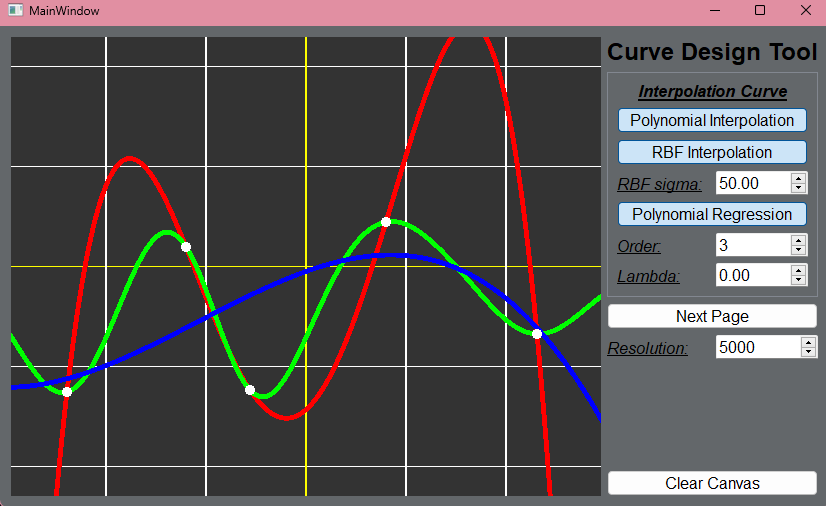
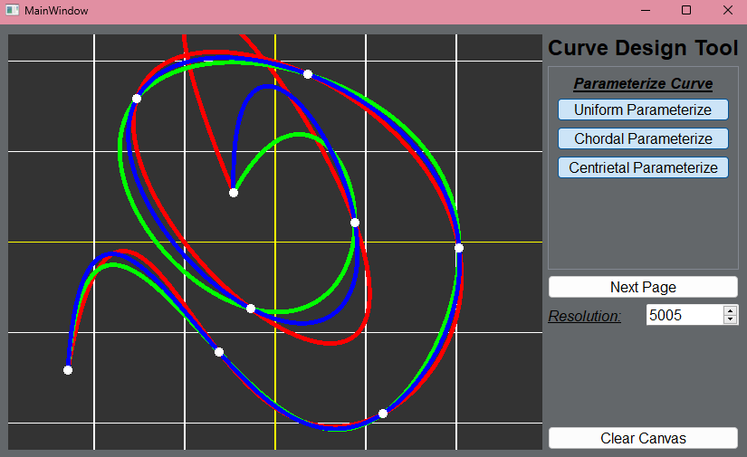
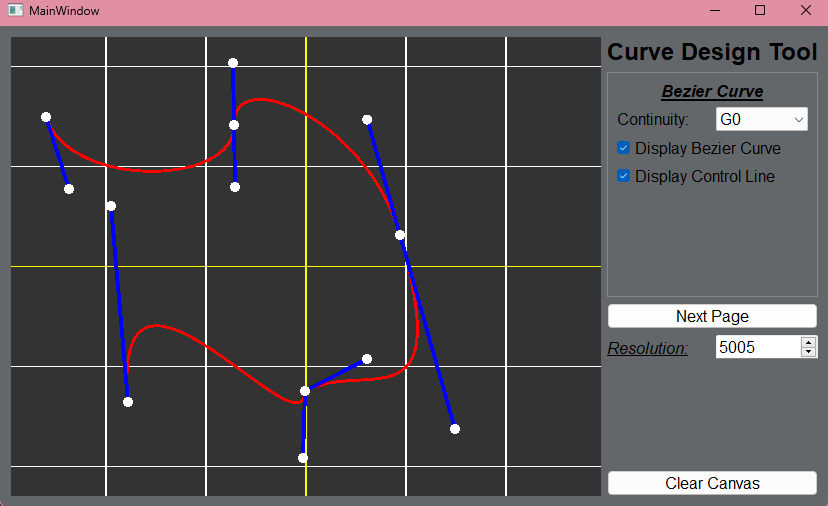

# 2D Curve Design Tool

The Qt Curve Designer is a comprehensive tool for curve design and visualization, leveraging the power of OpenGL through Qt's `QOpenGLWidget`. This tool offers a variety of curve design methods, from interpolation to regression and Bezier curves creating interaction.

## Features

#### Interpolation and Regression

1. **Interpolation Methods**:
   * Polynomial Fitting
   * Radial Basis Function (RBF) Fitting
2. **Regression Method**:
   * Polynomial Regression

#### **Parametric Curves**:

* Uniform Parameterization
* Chordal Parameterization
* Centripetal Parameterization

#### **Bezier Curve Design**:

* Differentiate between anchor points (points on the curve) and control points (influencing the curvature and continuity around anchor points).
* Support G0, G1 and G2 continuity in control point controlling.

